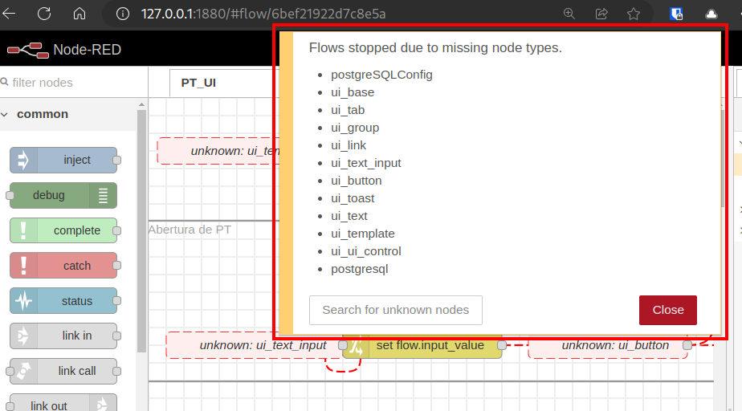
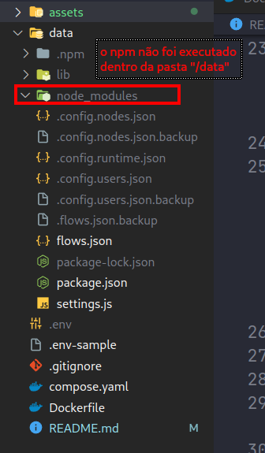

# Permissão de Trabalho com NodeRED

Esse projeto é uma POC para o serviço da Permissão de Trabalho desenvolvido pela [BSafer](https://bsafer.io).
Por motivos de desenvolvimento, esse projeto permanece privado, salvo algumas exceções criadas para desenvolvimento de terceiros.

## Como utilizar?

1. Clone o repositório
```sh
git clone https://github.com/bsafer-organization/pt-node-red-poc.git
```

2. Entre na pasta e execuse o docker pelo `compose.yaml`
```sh
cd ./pt-node-red-poc

# Execute o compose up com a flag --build
# para garantir a construção da imagem do Dockerfile
# Depois pode executar apenas `docker compose up -d`
docker compose up -d --build
```

3. Quando acessar pela primeira vez o projeto no endpoint [localhost:1880](http://localhost:1880), notará **um erro de falta de pacotes no projeto**. Isso se dá porque a imagem padrão do **NodeRED** não executa o `npm install` dentro da pasta `/data` por padrão. Não tive muito tempo para trabalhar nesse erro e construir uma imagem persolizada para executar da maneira correta, será necessário corrigir manualmente.
    - 
    - 

> Não destrua os containers criados pelo docker compose, apenas de um `stop` neles ou execute o passo abaixo em outra aba do terminal

4. Instalação manual dos pacotes dentro do container:
    1. Entre no container:
    ```sh
    # É provavel que o nome do container se mantenha o mesmo "pt-node-red-node-red-1"
    docker exec -it <nome-do-container> bash
    ```
    2. Entre na pasta `/data` (a mesma que está integrada ao volume da pasta local ao projeto, `./node-red/data`). E execute o comando `npm install`:
    ```sh
    cd /data
    npm install
    
    # A pasta `./node-red/data/node_modules` deve estar populada com os pacotes 
    ```
    3. Saia do container e reinicie:
    ```sh
    docker compose up
    ```
    4. Fazendo isso, o erro de falta dos pacotes será resolvido. Também não é necessário repetir essa ação, pois o volume dentro da pasta local `./node-red/data/node_modules` será persistido.

## O que está configurado dentro do Docker

1. NodeRED com todos os fluxos criados até o momento
    1. [localhost:1880](http://localhost:1880)
2. Postgres como banco de dados
    1. `localhost:5432`
    2. Ou internamente pelo `container_name` na variável de ambiente `POSTGRES_HOST`
3. Client do Postgres, Adminer.